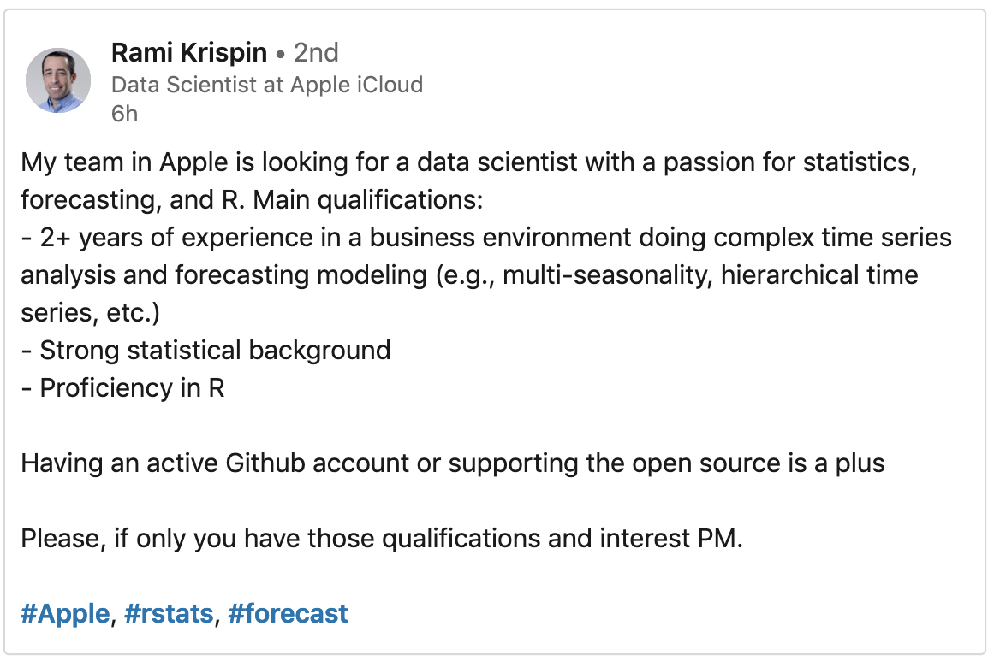
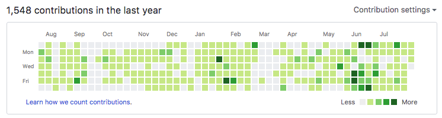
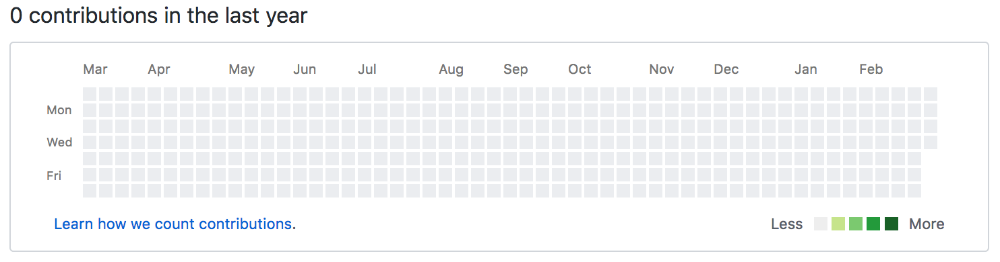
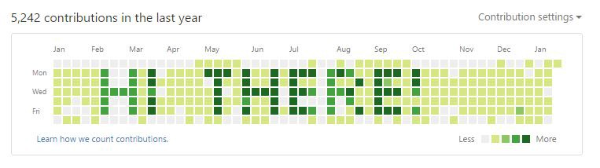

---
output:
  pdf_document: default
  html_document: default
---
# INSTALLATION

In this section, we make sure your computer is set up with everything installed. And by everything, I mean

* R
* RStudio
* Git
* Github

## Why would I want to install all that?

R is the most popular open-source programming language that was designed to do statistics, and [https://redmonk.com/sogrady/2019/03/20/language-rankings-1-19/](15th most popular language overall). It vies with Python as the language of choice for data science.

RStudio is the leading IDE to write R code with. In other words, when you want to write an R script, you'll be opening RStudio on your computer to do it.

Git allows you to do version control, so it's easier to save different versions of your code. 

Github is a way of saving all the different versions of your code to the cloud, in a way that's easy to share. 

I'll explain that in more depth later. First, let's install everything.

## Installing R and RStudio

1) Download R from this page [https://cran.r-project.org/](https://cran.r-project.org/) which has links for Windows, Mac and Linux. Run the installation package using the default settings. We are using R because it is a widely used and open source language that has its roots in statistics. 

2) Download RStudio from this page, but only after you've installed R. [https://www.rstudio.com/products/rstudio/download/](https://www.rstudio.com/products/rstudio/download/) . You have to scroll down a bit to get to the section on Installers for Supported Platforms. 

3) Set up Github.
Follow the tutorial here:
[https://happygitwithr.com/github-acct.html](https://happygitwithr.com/github-acct.html)

4) Install Git on your local computer
Follow the tutorial here:
[https://happygitwithr.com/install-git.html](https://happygitwithr.com/install-git.html)

## Test it all works
The best tutorial I've found to test everything works is from Jenny Bryan. Follow chapters 9 to 14 of her online book "Happy Git With R" to make sure RStudio can sync with Github with a push of a button. 
[https://happygitwithr.com/connect-intro.html](https://happygitwithr.com/connect-intro.html)

## Wait ... what is Git again?

There are two ways to save a file.

The first way saves the file as it is right now. Computer programmers call this a "state". A spreadsheet is an example of a state. Does a state remember that the numbers in cell C3 are in bold? Yes. But does it remember *when* you changed it to bold? No, the spreadsheet only knows what state it's in now.

This has implications if you want to try something new in your spreadsheet, but want to keep a copy of the old version just in case it doesn't work out. Think of your hard disk like a cupboard, and your file as a brick. Saving the file to your hard disk is like putting the brick in your cupboard. It just sort of sits there, taking up space. But now if you go File -> Save As, you'll end up with two bricks, complete and whole, sitting in your cupboard, taking up even more space. And now you've got to figure out which one is which, and that involves figuring out some way of naming your bricks ("brick_version_01.xls", "brick_version_02.xls"), so you can remember which one was the latest version. And if you're anything like me, you won't. 

The second way of saving the file doesn't save the actual file at all. Instead, you save the history of every change you've ever made to your project since the beginning. Opening your file isn't like taking a brick out of the cupboard, it's like following the instructions to make a brick from scratch, starting with how to mine the clay. 

Which way is better? Well, if you only have one file, save it like a brick. It's how normal people do it. But as programmers, the second way is absolutely better, because we work on multiple files at once, and can't easily save an entire folder of stuff each time we want a new version. 

And how do you remember every change you've ever made to a folder? Git keeps track of it. 

GitHub is the same thing, but in the cloud. (Note: There are other cloud-based Git repositories, such as BitBucket and Gitlab.)

That's why, before we learn any data science coding, we installed Git and Github.

## Bonus reasons to learn Git and Github

Because the best jobs in data science require you to know about version control. 

Because your Github account publicly displays the number of times you've committed files, and some employers make hiring decisions based on how green it looks. You want your Github graph to look like this:

... rather than like this:

Bonus points if you can make it look like this:

## Time frame
Installing new software can take longer than you think. It could take just half an hour to install everything above and set up your account. But it sometimes takes much, much longer, depending on your setup. Even a full day. Jenny Bryan's book is the most comprehensive book I've seen on installing everything, and seems to explore every possibility. Use it if you get stuck.
