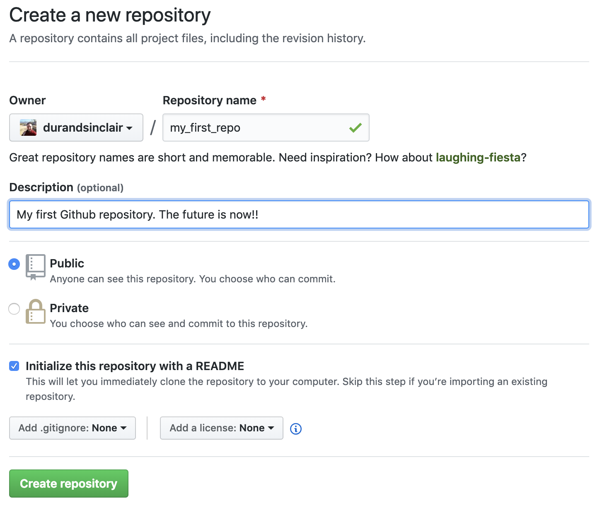

---
output:
  pdf_document: default
  html_document: default
---
# STARTING A NEW PROJECT

In this section, we look at the different ways of starting a project in R. There are three ways you can do it.

The optimal way to do it is to use Git and Github, so your project is properly version controlled, and backed up to the cloud right from the start. That means we have to set up a Github repository. We then code up our solution on our own computer, syncing periodically with our Github account.

The alternative way to do it is set up a project on your own computer, not worrying about syncing to Github. 

The worst way is to just use a single project file.

### Method 1: Create a project in Github.

* Log into your Github account at [github.com](github.com)
* At the top right hand side, you'll see a plus sign with a drop down arrow. Click it and then click New Repository

* Pick a name for your repository. The name should have no spaces, so I'm calling mine my_first_repo, and describing it as "My first repo in Github. The future is now!" Also, I'm setting mine to Public, which means anyone can find it. Setting it to private means only you get to see the content. I've also ticked "Initialize this repository with a README" 
* Click the green "Clone or Download" button to get the URL of your repository. 
* Notice that you can either "Clone with SSH" or "Clone with HTTPS". This refers to how Github can authenticate it's you. SSH authenticates you by getting you to download a special file called a key. Learn about how to do that in [chapter 11 of Happy Git With R](https://happygitwithr.com/ssh-keys.html). Or, you can set up your authentication using HTTPS. Learn about that in [chapter 10](https://happygitwithr.com/credential-caching.html). 
* Copy the link by clicking the 

to be continued...
