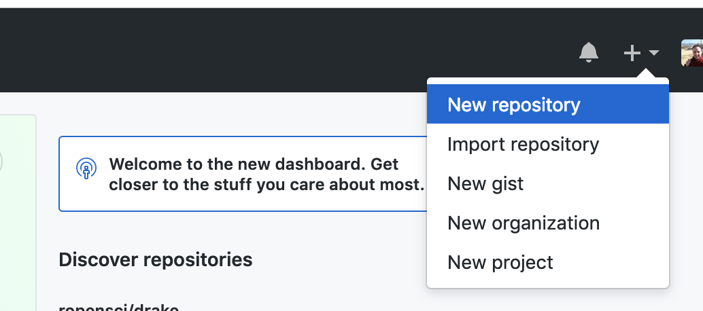

# STARTING A NEW PROJECT

In this section, we look at the different ways of starting a project in R.

The optimal way to do it is to use Git and Github, so your project is properly version controlled, and backed up to the cloud. Here's a good workflow to use.

### Step 1: Create a project in Github.

* Log into your Github account at [github.com](github.com)
* At the top right hand side, you'll see a plus sign with a drop down arrow. Click it and then click New Repository

* 
